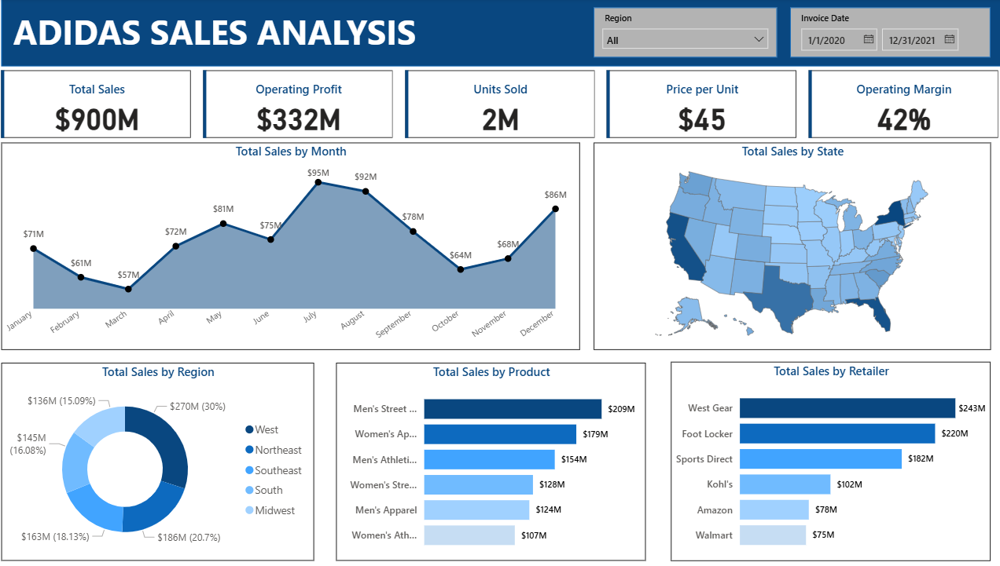

# Adidas Sales Analysis (Power BI Dashboard)

📊 This project is a beginner-level **Power BI dashboard** built using a sample Adidas sales dataset.  
The goal is to analyze sales performance across regions, products, and retailers, and present insights through interactive visualizations.

---

## 🔑 Key Insights
- **Total Sales:** $900M  
- **Operating Profit:** $332M  
- **Units Sold:** 2M  
- **Operating Margin:** 42%  
- Sales peaked in **July ($95M)**  
- The **West region** contributed the highest sales share (30%)  
- **Men’s Street Footwear** was the top-selling product ($209M)  
- **West Gear** led retailer sales with $243M  

---

## 📂 Project Contents
- `adidas.pbix` → Power BI project file  
- `Dataset.csv` → Sample Adidas sales dataset  
- `Dashboard.png` → Dashboard screenshot  

---

## 📸 Dashboard Preview

---

## 🛠️ Tools Used
- **Power BI** → Data cleaning, modeling, and visualization  
- **Excel/CSV** → Data source  

---

## 🚀 How to Use
1. Download the `.pbix` file.  
2. Open it in **Power BI Desktop**.  
3. Explore filters (Region, Date) and interactive charts.  

---

## 📌 About
This is a practice project created for portfolio purposes.  
It does not use real Adidas company data.
